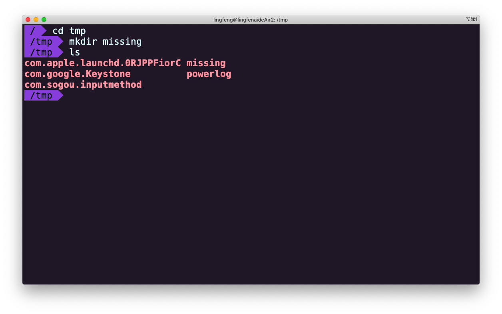
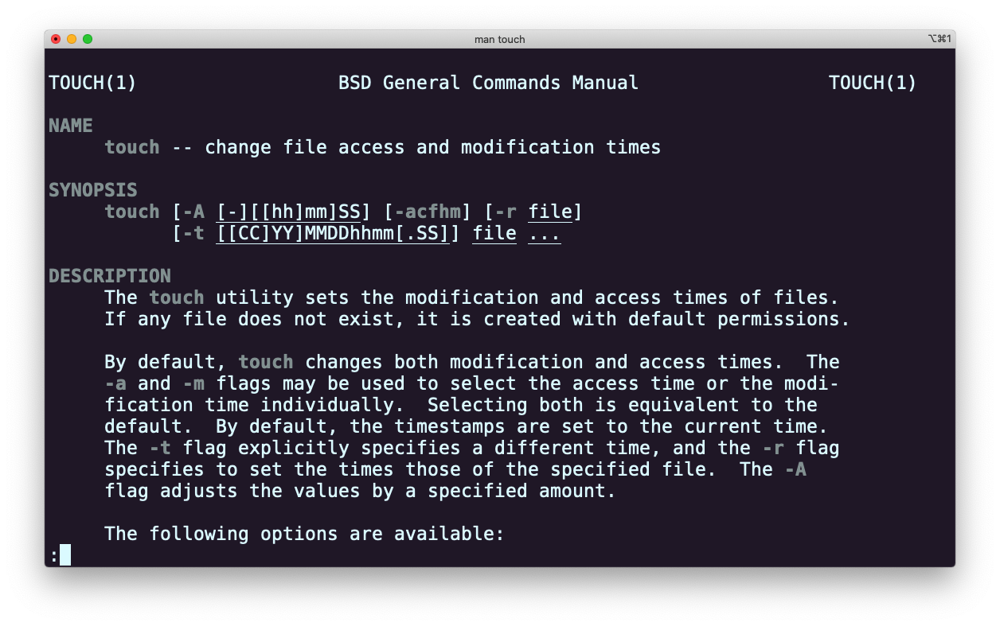
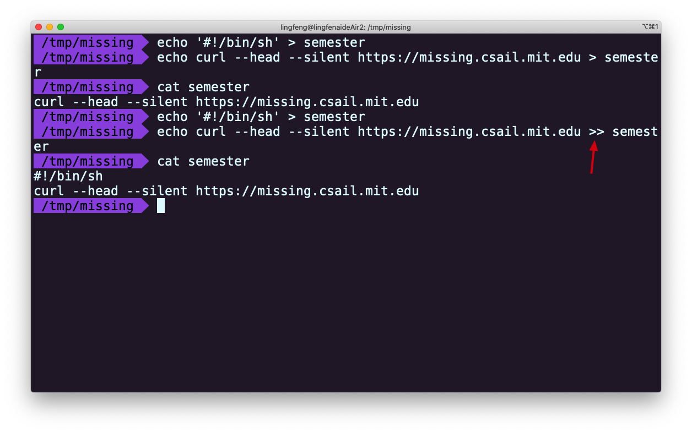
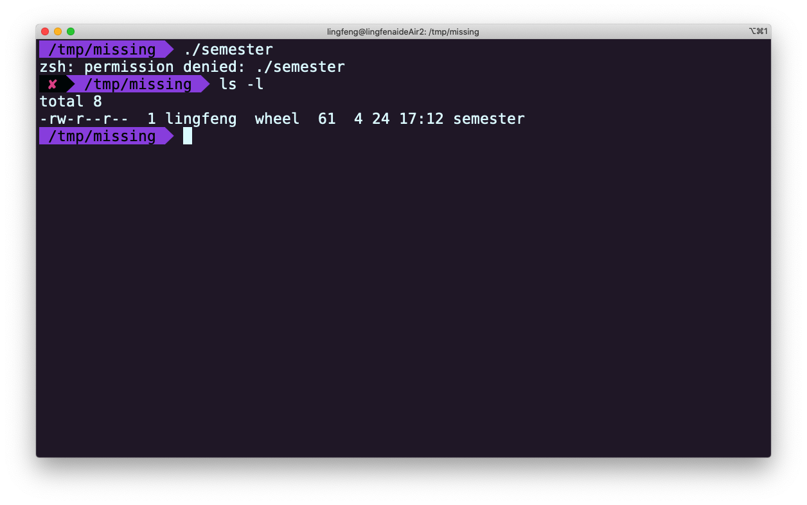
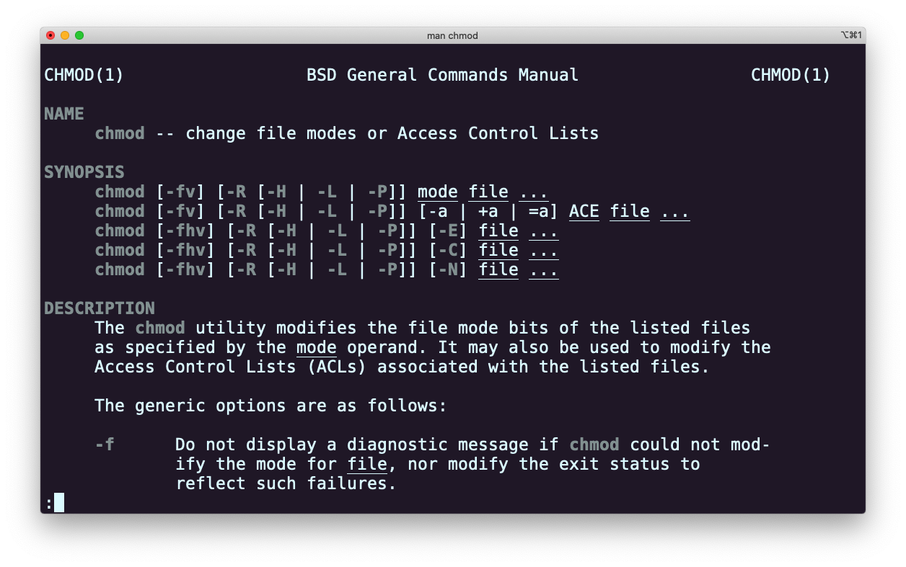
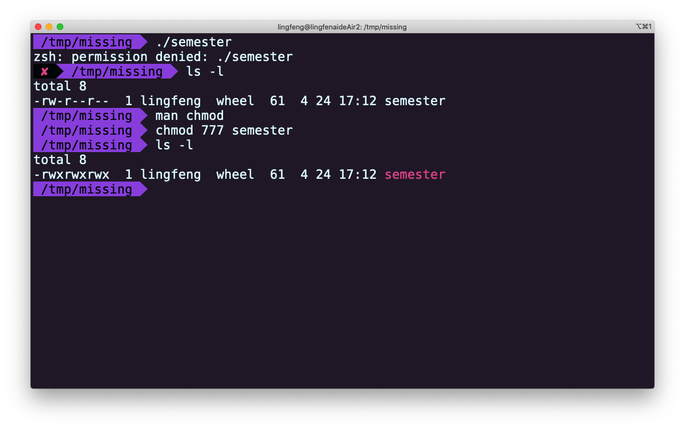
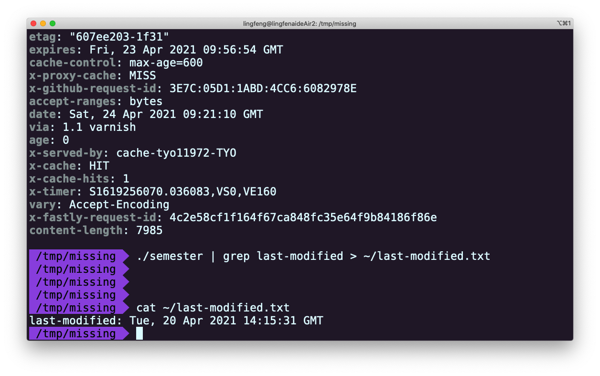

# Lecture01 - 课程概览与shell

## 动机

作为计算机科学家，我们知道计算机在协助完成重复性任务方面非常出色。然而，我们常常忘记，这同样适用于我们对计算机的使用，也同样适用于我们希望我们的程序所要进行的计算。在从事与计算机相关的工作时，我们有很多触手可及的工具可以帮助我们更高效的解决问题。但是我们中的大多数人实际上只利用了这些工具中的很少一部分，我们常常只是死记硬背一些如咒语般的命令，或是当我们遇到困难时，就盲目地从互联网上复制粘贴命令。

这门课就是为了解决这个问题。

我们想教你如何充分利用你所知道的工具，向你展示新工具，也许我们还可以促使您想要去探索（甚至是去开发）更多的工具。 我们认为这是大多数计算机科学相关课程中缺少的重要一环。

## 课程结构

该课程由 11 个 1 小时左右的讲座组成，每个讲座围绕一个特定的主题。讲座在很大程度上是独立的，尽管随着课程的进行，我们会假定你已经熟悉了早期讲座的内容。我们在网上有讲义，但在课堂上会有很多内容（例如以演示的形式）可能不在讲义中。我们将对讲座进行录制，并将录制下的课程发布在网上。

我们希望在 11 个 1 小时左右的讲座中涵盖很多内容，因此课程的信息密度是相当大的。为了让你有时间按照自己的节奏掌握课程内容，每个讲座都包括一套练习，指导你掌握讲座的关键点。每次讲座结束后，我们都会安排办公时间，帮助回答你可能遇到的任何问题。如果您参加的是在线课程，可以发送邮件到 missing-semester@mit.edu 来联系我们。

由于时间有限，我们无法像完整的课程那样详细地介绍所有的工具。在可能的情况下，我们会尽力为你指出进一步研究某个工具或主题的优秀资源，但如果有什么特别吸引你的地方，不要犹豫，请联系我们寻求指导。

# 主题 1: The Shell

## shell 是什么？

现在的计算机有各种各样的交互接口让我们进行指令的输入；从炫酷的图形用户界面（GUI）、语音输入甚至是 AR/VR 都无处不在。这些交互接口可以覆盖 80% 的使用场景，但它们往往在根本上限制了你的操作方式——你不能按下一个不存在的按钮，或用语音输入一个还没有被录入的指令。为了充分利用计算机提供的工具，我们不得不用传统的方式，使用文字接口：Shell。

几乎所有你能接触到的平台都支持某种形式的 shell ，而且有些平台提供了多个 shell 供你选择。虽然它们在细节上可能有所不同，但它们的核心功能都是相同的：它们允许你运行程序，给定输入，并获取某种半结构化的输出。

在本节课中，我们将重点介绍 Bourne Again SHell ，简称 `"bash"` 的使用。这是最广泛使用的 shell 之一，它的语法与其他 shell 相似。要打开一个 **shell 提示符** （你输入指令的地方），你首先需要打开一个 **终端** 。你的设备可能已经安装了终端，或者你可以安装一个，这并不难。

## 使用 shell

当您打开终端时，您会看到一个提示符，它看起来一般是这个样子的：

```sh
missing:~$ 
```

这是 shell 的主要文本接口。它告诉你，你的主机名是 `missing` ，你当前工作目录，或者说你目前所在的位置是 `~` (表示 `"home"` )。 `$` 符号表示您现在的身份不是 root 用户（稍后会介绍）。在这个提示符中，你可以输入一个 **命令** ，然后由 shell 来解析。最基本的命令是执行一个程序：

```sh
missing:~$ date
Fri 10 Jan 2020 11:49:31 AM EST
missing:~$ 
```

在这里，我们执行了 `date` 程序，它（也许并不令人惊讶地）打印出了当前的日期和时间。然后， shell 等待我们输入另一条命令。我们也可以执行一个带 **参数** 的命令：

```sh
missing:~$ echo hello
hello
```

在这个例子中，我们告诉 shell 执行带有参数 `hello` 的 `echo` 程序。 `echo` 程序只是将它的参数打印出来。 shell 基于空格分割命令并进行解析，然后运行第一个单词所代表的程序，并将后面的每个单词作为参数提供给程序。如果你想提供一个包含空格或其他特殊字符的参数（例如，一个名为 `"My Photos"` 的目录），你可以用 `'` （单引号）或 `"` （双引号）将参数包裹起来，或者使用转义符号 `\` 进行处理（`My\ Photos`）。

但是， shell 是如何知道如何找到 `date` 或 `echo` 程序的呢？其实，shell 是一个编程环境，就像 Python 或 Ruby 一样，所以它有变量、条件、循环和函数（下一节课进行讲解）。当你在 shell 中执行命令时，你实际上是在写一小段代码，该代码由 shell 进行解释。如果你要求 shell 执行某个指令，但是该指令并不是 shell 所了解的编程关键字，那么它会去查询 **环境变量** `$PATH` ，它会列出当 shell 接到某条指令时，进行程序搜索的路径：

```sh
missing:~$ echo $PATH
/usr/local/sbin:/usr/local/bin:/usr/sbin:/usr/bin:/sbin:/bin
missing:~$ which echo
/bin/echo
missing:~$ /bin/echo $PATH
/usr/local/sbin:/usr/local/bin:/usr/sbin:/usr/bin:/sbin:/bin
```

当我们执行 `echo` 命令时，shell 知道它应该执行 `echo` 程序，然后在 `$PATH` 中搜索由 `:` 所分割的一系列目录的列表，基于名字搜索该程序。当找到该程序时便执行它（假定该文件是 **可执行程序** ，后续课程将讲解）。可以使用 `which` 程序查询某个程序名代表的是哪个具体的程序。我们也可以完全绕过 `$PATH` ，通过直接指定需要执行的程序的路径来执行该程序。

## 在 shell 中导航

shell 中的路径是一组被分割的目录，在 Linux 和 macOS 上使用 `/` 分割，而在 Windows 上使用 `\` 分割。路径 `/` 代表的是文件系统的根目录，所有的目录和文件都包括在这个路径之下，在 Windows 上每个磁盘分区都有一个根目录（例如： `C:\` ）。 我们假设您在学习本课程时使用的是 Linux 文件系统。如果某个路径以 `/` 开头，那么它是一个 **绝对路径** ，其他的都是 **相对路径** 。相对路径是指相对于当前工作目录的路径，当前工作目录可以使用 `pwd` 命令来获取。此外，切换目录需要使用 `cd` 命令。在路径中，`.` 表示的是当前目录，而 `..` 表示上级目录：

```sh
missing:~$ pwd
/home/missing
missing:~$ cd /home
missing:/home$ pwd
/home
missing:/home$ cd ..
missing:/$ pwd
/
missing:/$ cd ./home
missing:/home$ pwd
/home
missing:/home$ cd missing
missing:~$ pwd
/home/missing
missing:~$ ../../bin/echo hello
hello
```

注意，我们的 shell 提示符会实时显示我们当前的工作目录是什么。你可以配置你的提示符来显示各种有用的信息，我们将在以后的课程中介绍这些信息。

一般来说，如果我们没有指定路径，当我们运行一个程序时，它将在当前的目录下运行。例如，我们通常会搜索文件，并在需要时创建新文件。

要查看指定目录中的包含的文件，我们可以使用 `ls` 命令：

```sh
missing:~$ ls
missing:~$ cd ..
missing:/home$ ls
missing
missing:/home$ cd ..
missing:/$ ls
bin
boot
dev
etc
home
...
```

除非我们利用第一个参数来指定特定的目录，否则 `ls` 将打印当前目录下所包含的文件。大多数命令接受以 `"-"` 开头的标志和选项（带有数值的标志）来修改程序的行为。通常，使用 `-h` 或 `--help` 标志运行一个程序会打印一些帮助信息，告诉你有哪些标志和选项可用。例如，`ls --help` 的输出如下：

```sh
  -l                         use a long listing format
```

```sh
missing:~$ ls -l /home
drwxr-xr-x 1 missing  users  4096 Jun 15  2019 missing
```

这个参数可以更加详细地打印出目录下文件的信息。首先，该行开头的字符 `d` 表示 `missing` 是一个目录。然后是接在后面的九个字符，每三个字符（rwx）为一组，一共三组。三组字符分别表示文件的所有者（`missing`）、用户组（`users`）和其他所有人对当前项具有的权限。其中 `-` 表示该用户不具备相应的权限。从上面的信息来看，只有文件所有者可以修改（`w`） `missing` 文件夹 （例如添加或删除文件夹中的文件）。为了进入某个目录，用户必须对该目录（及其父目录）有 `"搜索"` 权限（用 `x` 表示 `"可执行"` ）。为了列出它的包含的内容，用户必须对该目录具备读权限（`r`）。对于文件来说，权限的意义也是类似的。注意，`/bin` 目录下的程序在最后一组，即表示所有人的用户组中，均包含 `x` 权限，也就是说任何人都可以执行这些程序。

这时，你还需要掌握几个常用的命令，例如 `mv` （用于重命名或移动文件）、 `cp` （拷贝文件）以及 `mkdir` （新建目录）。

如果你想了解更多关于程序的参数、输入、输出或程序如何工作的信息，可以试试使用 `man` 程序。它把一个程序的名称作为参数，然后它将对应程序的文档（用户手册）显示出来。注意，使用 `q` 可以退出该程序。

```sh
missing:~$ man ls
```

## 在程序间创建连接

在 shell 中，程序有两个主要的 `"流"` 与它们相关联：它们的 `输入流` 和它们的 `输出流` 。程序会从输入流中读取输入，而当程序打印信息时，程序会将信息输出到它的输出流中。通常情况下，一个程序的输入流和输出流都是你的终端。就是说，你的键盘作为输入，你的屏幕作为输出。但是，我们也可以对这些流进行重定向！

最简单的重定向是 `< file` 和 `> file` 。这两个命令可以将程序的输入输出流分别重定向到文件：

```sh
missing:~$ echo hello > hello.txt
missing:~$ cat hello.txt
hello
missing:~$ cat < hello.txt
hello
missing:~$ cat < hello.txt > hello2.txt
missing:~$ cat hello2.txt
hello
```

您还可以使用 `>>` 来向一个文件追加内容。使用管道（ **pipes** ），我们能够更好的利用文件重定向。 `|` 操作符允许我们将一个程序的输出和另外一个程序的输入连接起来：

```sh
missing:~$ ls -l / | tail -n1
drwxr-xr-x 1 root  root  4096 Jun 20  2019 var
missing:~$ curl --head --silent google.com | grep --ignore-case content-length | cut --delimiter=' ' -f2
219
```

我们会在数据清理一章中更加详细的探讨如何更好的利用管道。

## 一个功能全面又强大的工具

在大多数类 Unix 的系统中，有一个用户很特别： `"root"` 用户。你可能已经在上面的文件列表中看到了它。 root 用户几乎不受任何访问限制，它可以创建、读取、更新和删除系统中的任何文件。通常我们并不会以 root 用户的身份直接登录系统，因为这样很容易会因为某些错误的操作而破坏系统。取而代之的是我们会在需要的时候使用 `sudo` 命令。顾名思义，它的作用是让你可以以 `su` （ `super user` 或 `root` 的简写）的身份执行一些操作。当您遇到拒绝访问（ `permission denied` ）的错误时，通常是因为此时您必须是 root 用户才能操作。不过，请确保你首先仔细检查你是否真的需要执行此操作。

有一件事你必须要以 root 身份才能做的，那就是向 `sysfs` 文件写入内容。系统被挂载在 `/sys` 下， `sysfs` 文件则将一些内核参数以文件的形式暴露出来。因此，您不需要借助任何专用的工具，就可以轻松地在运行期间配置系统内核。**注意 Windows 和 macOS 没有这个文件**

例如，您笔记本电脑的屏幕亮度是通过 `brightness` 文件暴露出来的，它位于：

```sh
/sys/class/backlight
```

通过将数值写入该文件，我们可以改变屏幕的亮度。现在，你可能想通过以下命令修改屏幕亮度：

```sh
$ sudo find -L /sys/class/backlight -maxdepth 2 -name '*brightness*'
/sys/class/backlight/thinkpad_screen/brightness
$ cd /sys/class/backlight/thinkpad_screen
$ sudo echo 3 > brightness
An error occurred while redirecting file 'brightness'
open: Permission denied
```

出乎意料的是，我们使用了 `sudo` 命令还是得到了一个错误信息！关于 shell ，有件事我们必须要知道。`|`、`>`、和 `<` 是通过 shell 执行的，而不是被各个程序单独执行。 `echo` 等程序并不知道 `|` 的存在，它们只知道从自己的输入输出流中进行读写。 对于上面这种情况， shell （权限为您的当前用户）在设置 `sudo echo` 前尝试打开 brightness 文件并写入，但是系统拒绝了 shell 的操作因为此时 shell 不是 root 用户。

明白这一点后，我们可以将命令修改如下：

```sh
$ echo 3 | sudo tee brightness
```

因为打开 `/sys` 文件的是 `tee` 这个程序，并且该程序以 `root` 权限在运行，因此操作可以进行。 这样您就可以在 `/sys` 中愉快地玩耍了，例如修改系统中各种 LED 的状态（路径可能会有所不同）：

```sh
$ echo 1 | sudo tee /sys/class/leds/input6::scrolllock/brightness
```

## 接下来...

学到这里，您掌握的 shell 知识已经可以完成一些基础的任务了。您应该已经可以查找感兴趣的文件并使用大多数程序的基本功能了。在下一节课中，我们会探讨如何利用 shell 及其他工具执行并自动化更复杂的任务。

## 课后练习

本课程中的每节课都包含一系列练习题。有些题目是有明确目的的，另外一些则是开放题，例如“尝试使用 X 和 Y”，我们强烈建议您一定要动手实践，用于尝试这些内容。此外，我们没有为这些练习题提供答案。如果有任何困难，您可以发送邮件给我们并描述你已经做出的尝试，我们会设法帮您解答。

1. 本课程需要使用类 Unix shell，例如 Bash 或 ZSH。如果您在 Linux 或者 MacOS 上面完成本课程的练习，则不需要做任何特殊的操作。如果您使用的是 Windows，则您不应该使用 cmd 或是 Powershell；您可以使用 `Windows Subsystem for Linux` [https://docs.microsoft.com/en-us/windows/wsl/](https://docs.microsoft.com/en-us/windows/wsl/) 或者是 Linux 虚拟机。使用 `echo $SHELL` 命令可以查看您的 shell 是否满足要求。如果打印结果为 `/bin/bash` 或 `/usr/bin/zsh` 则是可以的。
2. 在 `/tmp` 下新建一个名为 `missing` 的文件夹。
3. 用 `man` 查看程序 `touch` 的使用手册。
4. 用 `touch` 在 `missing` 文件夹中新建一个叫 `semester` 的文件。
5. 将以下内容一行一行地写入 `semester` 文件：
    ```sh
    #!/bin/sh
    curl --head --silent https://missing.csail.mit.edu
    ```
    第一行可能有点棘手， `#` 在Bash中表示注释，而 `!` 即使被双引号（`"`）包裹也具有特殊的含义。 单引号（`'`）则不一样，此处利用这一点解决输入问题。更多信息请参考 `Bash quoting` [https://www.gnu.org/software/bash/manual/html_node/Quoting.html](https://www.gnu.org/software/bash/manual/html_node/Quoting.html) 手册
6. 尝试执行这个文件。例如，将该脚本的路径（`./semester`）输入到您的shell中并回车。如果程序无法执行，请使用 `ls` 命令来获取信息并理解其不能执行的原因。
7. 查看 `chmod` 的手册(例如，使用 `man chmod` 命令)
8. 使用 `chmod` 命令改变权限，使 `./semester` 能够成功执行，不要使用 `sh semester` 来执行该程序。您的 shell 是如何知晓这个文件需要使用 `sh` 来解析呢？更多信息请参考： `shebang` [https://en.wikipedia.org/wiki/Shebang_(Unix)](https://en.wikipedia.org/wiki/Shebang_(Unix))
9. 使用 `|` 和 `>` ，将 `semester` 文件输出的最后更改日期信息，写入主目录下的 `last-modified.txt` 的文件中
10. 写一段命令来从 `/sys` 中获取笔记本的电量信息，或者台式机 CPU 的温度。注意：macOS 并没有 sysfs，所以 Mac 用户可以跳过这一题。

## 课后练习解答

本课程中的每节课都包含一系列练习题。有些题目是有明确目的的，另外一些则是开放题，例如“尝试使用 X 和 Y”，我们强烈建议您一定要动手实践，用于尝试这些内容。此外，我们没有为这些练习题提供答案。如果有任何困难，您可以发送邮件给我们并描述你已经做出的尝试，我们会设法帮您解答。

1. 本课程需要使用类 Unix shell，例如 Bash 或 ZSH。如果您在 Linux 或者 MacOS 上面完成本课程的练习，则不需要做任何特殊的操作。如果您使用的是 Windows，则您不应该使用 cmd 或是 Powershell；您可以使用 `Windows Subsystem for Linux` [https://docs.microsoft.com/en-us/windows/wsl/](https://docs.microsoft.com/en-us/windows/wsl/) 或者是 Linux 虚拟机。使用 `echo $SHELL` 命令可以查看您的 shell 是否满足要求。如果打印结果为 `/bin/bash` 或 `/usr/bin/zsh` 则是可以的。

    **参考解答：**

    在我的机器上运行 `echo $SHELL` 命令结果如下：

    ```sh
    $ echo $SHELL
    /bin/bash
    ```

2. 在 `/tmp` 下新建一个名为 `missing` 的文件夹。

    **参考解答：**

    ```sh
    $ cd tmp
    $ mkdir missing
    ```

    没有 tmp 目录就先创建该目录：
    
    ```sh
    $ mkdir tmp
    ```

    

3. 用 `man` 查看程序 `touch` 的使用手册。

    **参考解答：**

    ```sh
    $ man touch
    ```

    

4. 用 `touch` 在 `missing` 文件夹中新建一个叫 `semester` 的文件。

    **参考解答：**

    ```sh
    $ cd missing
    $ touch semester
    ```

5. 将以下内容一行一行地写入 `semester` 文件：
    ```sh
    #!/bin/sh
    curl --head --silent https://missing.csail.mit.edu
    ```
    第一行可能有点棘手， `#` 在Bash中表示注释，而 `!` 即使被双引号（`"`）包裹也具有特殊的含义。 单引号（`'`）则不一样，此处利用这一点解决输入问题。更多信息请参考 `Bash quoting` [https://www.gnu.org/software/bash/manual/html_node/Quoting.html](https://www.gnu.org/software/bash/manual/html_node/Quoting.html) 手册

    **参考解答：**

    ```sh
    $ echo '#!/bin/sh' > semester
    $ echo curl --head --silent https://missing.csail.mit.edu >> semester
    ```

    

6. 尝试执行这个文件。例如，将该脚本的路径（`./semester`）输入到您的shell中并回车。如果程序无法执行，请使用 `ls` 命令来获取信息并理解其不能执行的原因。

    **参考解答：**

    ```sh
    $ ./semester
    -bash: ./semester: Permission denied
    $ ls -l
    ```

    

7. 查看 `chmod` 的手册(例如，使用 `man chmod` 命令)


    **参考解答：**

    ```sh
    $ man chmod
    ```

    

8. 使用 `chmod` 命令改变权限，使 `./semester` 能够成功执行，不要使用 `sh semester` 来执行该程序。您的 shell 是如何知晓这个文件需要使用 `sh` 来解析呢？更多信息请参考： `shebang` [https://en.wikipedia.org/wiki/Shebang_(Unix)](https://en.wikipedia.org/wiki/Shebang_(Unix))

    **参考解答：**

    ```sh
    $ chmod 755 semester
    $ ls -l
    $ ./semester
    HTTP/2 200 
    server: GitHub.com
    content-type: text/html; charset=utf-8
    ...
    ```

    

9. 使用 `|` 和 `>` ，将 `semester` 文件输出的最后更改日期信息，写入主目录下的 `last-modified.txt` 的文件中

    **参考解答：**

    ```sh
    $ ./semester | grep last-modified > ~/last-modified.txt
    $ cat ~/last-modified.txt
    ```

    

10. 写一段命令来从 `/sys` 中获取笔记本的电量信息，或者台式机 CPU 的温度。注意：macOS 并没有 sysfs，所以 Mac 用户可以跳过这一题。

    **参考解答：**

    电量信息放在 `/sys/class/power_supply` 目录下，不同机器信息具体存放位置不同，以下只做参考：

    ```sh
    $ cat /sys/class/power_supply/BAT1/capacity
    100
    ```