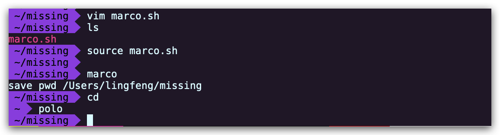
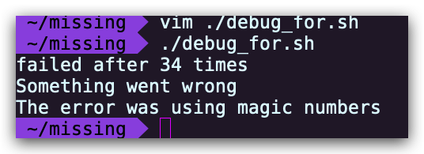
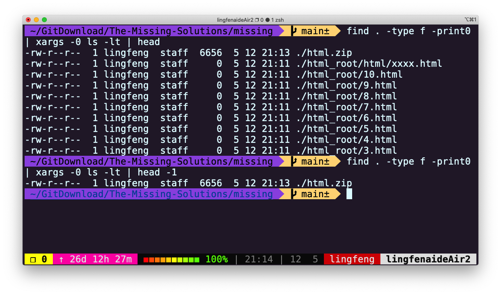
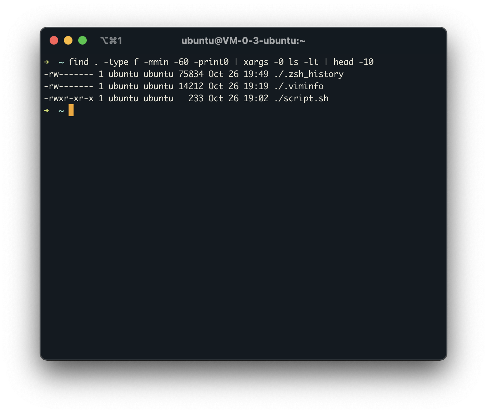

# Lecture02 - Shell 工具和脚本

在本节课中，我们将介绍使用 bash 作为脚本语言的一些基础知识，以及一些 shell 工具，这些工具涵盖了你将在命令行中不断执行的几个最常见的任务。

## Shell 脚本

到目前为止，我们已经看到了如何在 shell 中执行命令，并使用管道将命令组合起来使用。然而，在许多情况下，我们需要执行一系列的命令，并使用条件或循环这样的控制流。

shell 脚本是一种更加复杂度的工具。

大多数 shell 有自己的一套脚本语言，有变量、控制流和自己的语法。 shell 脚本与其他脚本编程语言不同之处在于，它是针对 shell 所从事的相关工作进行来优化。因此，创建命令流程（pipelines），将结果保存到文件中，以及从标准输入中读取都是 shell 脚本中的原子操作，这使得它比通用脚本语言更容易使用。在本节中，我们将重点讨论 bash 脚本，因为它是最常见的。

在 bash 中为变量赋值的语法是 `foo=bar` ，访问变量中存储的数值，其语法为 `$foo` 。需要注意的是，`foo = bar` （使用空格隔开）是不能正确工作的，因为它被解释为调用带有参数 `=` 和 `bar` 的 `foo` 程序。总的来说，在 shell 脚本中使用空格会起到分割参数的作用，有时候可能会造成混淆，使用时请务必检查。

Bash 中的字符串通过 `'` 和 `"` 分隔符来定义，但是它们的含义并不相同。以 `'` 定义的字符串为原义字符串，其中的变量不会被转义，而 `"` 定义的字符串会将变量值进行替换。

```sh
foo=bar
echo "$foo"
# 打印 bar
echo '$foo'
# 打印 $foo
```

和其他大多数的编程语言一样， `bash` 也支持控制流技术，包含 `if` 、 `case` 、 `while` 和 `for` 这些控制流关键字。同样地， `bash` 也支持带有参数的函数。下面这个函数是一个例子，它会创建一个目录并使用 `cd` 进入该目录：

```sh
mcd () {
    mkdir -p "$1"
    cd "$1"
}
```

这里 `$1` 是脚本的第一个参数。与其他脚本语言不同， bash 使用了各种特殊的变量来指代参数、错误代码和相关变量。下面列举其中一些变量，更完整的列表可以参考 [https://tldp.org/LDP/abs/html/special-chars.html](https://tldp.org/LDP/abs/html/special-chars.html) 。

- `$0` - 脚本名
- `$1` 到 `$9` - 脚本的参数， `$1` 是第一个参数，依此类推
- `$@` - 所有参数
- `$#` - 参数个数
- `$?` - 前一个命令的返回值
- `$$` - 当前脚本的进程识别码
- `!!` - 完整的上一条命令，包括参数。常见应用：当你因为权限不足执行命令失败时，可以使用 `sudo !!` 再尝试一次。
- `$_` - 上一条命令的最后一个参数。如果你正在使用的是交互式 shell，你可以通过按下 `Esc` 之后键入 `.` 来获取这个值。

命令通常使用 `STDOUT` 来返回输出值，使用 `STDERR` 来返回错误及错误码，便于脚本以更加友好的方式报告错误。返回码或退出状态是脚本/命令之间交流执行状态的方式。返回值 `0` 表示正常执行，其他所有非 `0` 的返回值都表示有错误发生。

退出码可以搭配 `&&`（与操作符）和 `||`（或操作符）使用，用来进行条件判断，决定是否执行其他程序。它们都属于短路运算符 [https://en.wikipedia.org/wiki/Short-circuit_evaluation](https://en.wikipedia.org/wiki/Short-circuit_evaluation) （short-circuiting） 同一行的多个命令可以用 `;` 分隔。程序 `true` 的返回码永远是 `0` ， `false` 的返回码永远是 `1` 。让我们看几个例子：

```sh
false || echo "Oops, fail"
# Oops, fail

true || echo "Will not be printed"
#

true && echo "Things went well"
# Things went well

false && echo "Will not be printed"
#

false ; echo "This will always run"
# This will always run
```

另一个常见的模式是以变量的形式获取一个命令的输出，这可以通过 **命令替换** （command substitution）实现。

当您通过 `$( CMD )` 这样的方式来执行 `CMD` 这个命令时，它的输出结果会替换掉 `$( CMD )` 。例如，如果执行 `for file in $(ls)` ，shell 首先将调用 `ls` ，然后遍历得到的这些返回值。还有一个冷门的类似特性是 **进程替换** （process substitution）， `<( CMD )` 会执行 `CMD` 并将结果输出到一个临时文件中，并将 `<( CMD )` 替换成临时文件名。这在我们希望返回值通过文件而不是 STDIN 传递时很有用。例如， `diff <(ls foo) <(ls bar)` 会显示文件夹 `foo` 和 `bar` 中文件的区别。

说了很多，现在该看例子了，下面这个例子展示了一部分上面提到的特性。这段脚本会遍历我们提供的参数，使用 `grep` 搜索字符串 `foobar` ，如果没有找到，则将其作为注释追加到文件中。

```sh
#!/bin/bash

echo "Starting program at $(date)" # date 会被替换成日期和时间

echo "Running program $0 with $# arguments with pid $$"

for file in "$@"; do
    grep foobar "$file" > /dev/null 2> /dev/null
    # 如果模式没有找到，则 grep 退出状态为 1
    # 我们将标准输出流和标准错误流重定向到 Null ，因为我们并不关心这些信息
    if [[ $? -ne 0 ]]; then
        echo "File $file does not have any foobar, adding one"
        echo "# foobar" >> "$file"
    fi
done
```

在条件语句中，我们比较 `$?` 是否等于 `0` 。 Bash 实现了许多类似的比较操作，您可以查看 test 手册 [https://man7.org/linux/man-pages/man1/test.1.html](https://man7.org/linux/man-pages/man1/test.1.html) 。在 bash 中进行比较时，尽量使用双方括号 `[[ ]]` 而不是单方括号 `[ ]` ，这样会降低犯错的几率，尽管这样并不能兼容 `sh` 。更详细的说明参见 [http://mywiki.wooledge.org/BashFAQ/031](http://mywiki.wooledge.org/BashFAQ/031) 。

当执行脚本时，我们经常需要提供形式类似的参数。bash 使我们可以轻松的实现这一操作，它可以基于文件扩展名展开表达式。这一技术被称为 shell 的 **通配** （globbing）。

- 通配符：当你想要利用通配符进行匹配时，你可以分别使用 `?` 和 `*` 来匹配一个或任意个字符。例如，对于文件 `foo` , `foo1` , `foo2` , `foo10` 和 `bar` , `rm foo?` 这条命令会删除 `foo1` 和 `foo2` ，而 `rm foo*` 则会删除除了 `bar` 之外的所有文件。
- 花括号`{}`：当你有一系列的指令，其中包含一段公共子串时，可以用花括号来自动展开这些命令。这在批量移动或转换文件时非常方便。

```sh
convert image.{png,jpg}
# 会展开为
convert image.png image.jpg

cp /path/to/project/{foo,bar,baz}.sh /newpath
# 会展开为
cp /path/to/project/foo.sh /path/to/project/bar.sh /path/to/project/baz.sh /newpath

# 也可以结合通配使用
mv *{.py,.sh} folder
# 会移动所有 *.py 和 *.sh 文件

mkdir foo bar

# 下面命令会创建foo/a, foo/b, ... foo/h, bar/a, bar/b, ... bar/h这些文件
touch {foo,bar}/{a..h}
touch foo/x bar/y
# 比较文件夹 foo 和 bar 中包含文件的不同
diff <(ls foo) <(ls bar)
# 输出
# < x
# ---
# > y
```

编写 `bash` 脚本有时候会很别扭和反直觉。例如 `shellcheck` [https://github.com/koalaman/shellcheck](https://github.com/koalaman/shellcheck) 这样的工具可以帮助你定位 `sh/bash` 脚本中的错误。

注意，脚本并不一定只有用 bash 写才能在终端里调用。比如说，这是一段 Python 脚本，作用是将输入的参数倒序输出：

```py
#!/usr/local/bin/python
import sys
for arg in reversed(sys.argv[1:]):
    print(arg)
```

内核知道去用 python 解释器而不是 shell 命令来运行这个脚本，因为脚本的开头第一行的 `shebang` [https://en.wikipedia.org/wiki/Shebang_(Unix)](https://en.wikipedia.org/wiki/Shebang_(Unix)) 。

使用 `env` [https://man7.org/linux/man-pages/man1/env.1.html](https://man7.org/linux/man-pages/man1/env.1.html) 命令编写 `shebang` 行是一种好的做法，它会利用环境变量中的程序来解析该脚本，这样就提高了脚本的可移植性。 `env` 会利用我们第一节课中介绍过的 `PATH` 环境变量来进行定位。例如，使用了 `env` 的 `shebang` 看上去是这样的 `#!/usr/bin/env python` 。

你应该记住 shell 函数和脚本之间的一些区别：

- 函数只能与 shell 使用相同的语言，脚本可以使用任意语言。因此在脚本中包含 `shebang` 是很重要的。
- 函数仅在定义时被加载，脚本会在每次被执行时加载。这让函数的加载比脚本略快一些，但每次修改函数定义，都要重新加载一次。
- 函数会在当前的 shell 环境中执行，脚本会在单独的进程中执行。因此，函数可以对环境变量进行更改，比如改变当前工作目录，脚本则不行。脚本需要使用 `export` 将环境变量导出，并将值传递给环境变量。
- 与其他程序语言一样，函数可以提高代码模块性、代码复用性并创建清晰性的结构。 shell 脚本中往往也会包含它们自己的函数定义。

# Shell 工具

## 查看命令如何使用

看到这里，你可能想知道如何为特定的命令找到合适的标记，例如 `ls -l` 、 `mv -i` 和 `mkdir -p` 。更普遍的是，给您一个命令行，您应该怎样了解如何使用这个命令行并找出它的不同的选项呢？一般来说，您可能会先去网上搜索答案，但是， UNIX 可比 StackOverflow 出现的早，因此我们的系统里其实早就内置了获取相关信息的方法。

在上一节中我们介绍过，最常用的方法是使用 `-h` 或  `--help` 标记来调用对应的程序。另外一个更详细的方法则是使用 `man` 命令。 `man` 命令是 `manual` [https://man7.org/linux/man-pages/man1/man.1.html](https://man7.org/linux/man-pages/man1/man.1.html) 的缩写，它提供了命令的用户手册（manpage）。例如， `man rm` 会输出命令 `rm` 的说明，同时还有其标记列表，包括之前我们介绍过的 `-i` 。事实上，目前我们给出的所有命令的说明链接，都是网页版的 Linux 命令手册。即使是您安装的第三方命令，前提是开发者编写了手册并将其包含在了安装包中。在交互式的、基于字符处理的终端窗口中，一般也可以通过 `:help` 命令或键入 `?` 来获取帮助。

有时候手册内容太过详细，让我们难以在其中查找那些最常用的标记和语法。 `TLDR pages` [https://tldr.sh/](https://tldr.sh/) 是一个很不错的替代品，它提供了一些案例，可以帮助您快速找到正确的选项。例如，我就常常在 `tldr` 上搜索 `tar` [https://tldr.ostera.io/tar](https://tldr.ostera.io/tar) 和 `ffmpeg` [https://tldr.ostera.io/ffmpeg](https://tldr.ostera.io/ffmpeg) 的用法。

## 查找文件

每个程序员面临的最常见的重复性任务之一是寻找文件或目录。所有类 UNIX 系统都带有 `find` [https://man7.org/linux/man-pages/man1/find.1.html](https://man7.org/linux/man-pages/man1/find.1.html) 工具，这是一个很好的查找文件的 shell 工具。 `find` 命令会递归地搜索符合条件的文件，例如：

```sh
# 查找所有名称为src的文件夹
find . -name src -type d
# 查找所有文件夹路径中包含test的python文件
find . -path '*/test/*.py' -type f
# 查找前一天修改的所有文件
find . -mtime -1
# 查找所有大小在500k至10M的tar.gz文件
find . -size +500k -size -10M -name '*.tar.gz'
```

除了列出所寻找的文件之外， `find` 命令还能对所有查找到的文件进行操作。这能极大地简化一些单调的任务：

```sh
# 删除全部扩展名为.tmp 的文件
find . -name '*.tmp' -exec rm {} \;
# 查找全部的 PNG 文件并将其转换为 JPG
find . -name '*.png' -exec convert {} {}.jpg \;
```

尽管 `find` 无处不在，单它的语法比较难以记忆。例如，为了查找满足模式 `PATTERN` 的文件，您需要执行 `find -name '*PATTERN*'` (如果您希望模式匹配时是不区分大小写，可以使用 `-iname` 选项）。你可以使用 `alias` 设置别名以简化上述操作，但 shell 的哲学之一便是寻找（更好用的）替代方案。记住，shell 最好的特性就是你只是在调用程序，因此您只要找到合适的替代程序即可（甚至自己编写）。例如， `fd` [https://github.com/sharkdp/fd](https://github.com/sharkdp/fd) 就是一个更简单、更快速、更友好的代替品。它有很多友好的默认设置，例如输出着色、默认支持正则匹配、支持 Unicode ，并且我认为它的语法更直观。例如查找一个模式 `PATTERN` 的语法是 `fd PATTERN` 。

大多数人都认为 `find` 和 `fd` 已经很好用了，但是有的人可能想知道，我们是不是可以有更高效的方法，例如不要每次都搜索文件而是通过编译索引或建立数据库的方式来实现更加快速地搜索。这就要靠 `locate` [https://man7.org/linux/man-pages/man1/locate.1.html](https://man7.org/linux/man-pages/man1/locate.1.html) 了。 `locate` 使用一个由 `updatedb` [https://man7.org/linux/man-pages/man1/updatedb.1.html](https://man7.org/linux/man-pages/man1/updatedb.1.html) 负责更新的数据库，在大多数系统中 `updatedb` 都会通过 `cron` [https://man7.org/linux/man-pages/man8/cron.8.html](https://man7.org/linux/man-pages/man8/cron.8.html) 每日更新。这便需要我们在速度和时效性之间作出权衡。而且， `find` 和类似的工具可以通过别的属性比如文件大小、修改时间或是权限来查找文件， `locate` 则只能通过文件名。 [https://unix.stackexchange.com/questions/60205/locate-vs-find-usage-pros-and-cons-of-each-other](https://unix.stackexchange.com/questions/60205/locate-vs-find-usage-pros-and-cons-of-each-other) 有一个更详细的对比。

## 查找代码

按文件名查找文件是很有用的，但是很多时候你的目标其实是根据文件的内容来查找。一个最常见的场景是你希望查找具有某种模式的全部文件，并找它们出现的位置。

为了实现这一点，很多类 UNIX 的系统都提供了 `grep` [https://man7.org/linux/man-pages/man1/grep.1.html](https://man7.org/linux/man-pages/man1/grep.1.html) 命令，它是用于对输入文本进行匹配的通用工具。它是一个非常重要的 shell 工具，我们会在后续的数据清理课程中详细介绍它。

`grep` 有很多标志，这也使它成为一个非常通用的工具。其中我经常使用的有 `-C` 标志：获取查找结果的上下文（Context）；`-v` 标志将对结果进行反选（Invert），也就是输出不匹配的结果。例如， `grep -C 5` 会输出匹配结果前后五行。当需要搜索大量文件的时候，使用 `-R` 标志会递归地进入子目录并搜索所有的文本文件。

但是，我们有很多办法可以对 `grep -R` 进行改进，例如使其忽略 `.git` 目录，使用多 CPU 等等。因此也出现了很多替代品，包括 `ack` [https://beyondgrep.com/](https://beyondgrep.com/) 、 `ag` [https://github.com/ggreer/the_silver_searcher](https://github.com/ggreer/the_silver_searcher) 和 `rg` [https://github.com/BurntSushi/ripgrep](https://github.com/BurntSushi/ripgrep) 。它们都特别好用，但是功能也都差不多，我比较常用的是 `ripgrep` ( `rg` ) ，因为它速度快，而且用法非常符合直觉。例如：

```sh
# 查找所有使用了 requests 库的文件
rg -t py 'import requests'
# 查找所有没有写 shebang 的文件（包含隐藏文件）
rg -u --files-without-match "^#!"
# 查找所有的foo字符串，并打印其之后的5行
rg foo -A 5
# 打印匹配的统计信息（匹配的行和文件的数量）
rg --stats PATTERN
```

请注意，与 `find` / `fd` 一样，重要的是你要知道有些问题使用合适的工具就会迎刃而解，而具体选择哪个工具则不是那么重要。

## 查找 shell 命令

到目前为止，我们已经学习了如何查找文件和代码，但随着你使用 shell 的时间越来越久，你可能想要找到之前输入过的特定命令。首先，按向上的方向键会显示你使用过的上一条命令，继续按上键则会遍历整个历史记录。

`history` 命令允许你以程序员的方式来访问 shell 中输入的历史命令。这个命令会在标准输出中打印 shell 中使用过的命令历史。如果我们要搜索历史记录，则可以利用管道将输出结果传递给 `grep` 进行模式搜索。 `history | grep find` 会打印包含 `find` 子串的命令。

对于大多数的 shell 来说，你可以使用 `Ctrl+R` 对命令历史记录进行回溯搜索。按下 `Ctrl+R` 后你可以输入子串来进行匹配，查找历史命令行。反复按下就会在所有搜索结果中循环搜索匹配的内容。在 `zsh` [https://github.com/zsh-users/zsh-history-substring-search](https://github.com/zsh-users/zsh-history-substring-search) 中，使用方向键上或下也可以完成这项工作。 `Ctrl+R` 可以配合 `fzf` [https://github.com/junegunn/fzf/wiki/Configuring-shell-key-bindings#ctrl-r](https://github.com/junegunn/fzf/wiki/Configuring-shell-key-bindings#ctrl-r) 使用。 `fzf` 是一个通用模糊查找工具，它可以和很多命令一起使用。这里我们可以对历史命令进行模糊查找并将结果以赏心悦目的格式输出。

另外一个和历史命令相关的技巧是基于历史的自动补全，我非常喜欢这个技巧。这一特性最初是由 `fish shell` [https://fishshell.com/](https://fishshell.com/) 引入的，它可以根据你最近使用过的开头相同的命令，动态地对当前 shell 命令进行补全。这一功能在 `zsh` [https://github.com/zsh-users/zsh-autosuggestions](https://github.com/zsh-users/zsh-autosuggestions) 中也可以使用，它可以极大的提高用户体验。

你可以修改 shell history 的行为，例如，如果在命令的开头加上一个空格，它就不会被加进 shell 记录中。当你输入包含密码或是其他敏感信息的命令时会用到这一特性。为此你需要在 `.bashrc` 中添加 `HISTCONTROL=ignorespace` 或者向 `.zshrc` 添加 `setopt HIST_IGNORE_SPACE` 。如果你不小心忘了在前面加空格，可以通过编辑。 `bash_history` 或 `.zhistory` 来手动地从历史记录中移除那一项。

## 文件夹导航

到目前为止，之前的所有操作我们都默认一个前提，即你已经位于想要执行命令的目录下，但是如何才能高效地在目录间随意切换呢？有很多简便的方法可以做到，比如设置 `alias` ，使用 `ln -s` [https://man7.org/linux/man-pages/man1/ln.1.html](https://man7.org/linux/man-pages/man1/ln.1.html) 创建符号连接等。而开发者们已经想到了很多更为精妙的解决方案。

就像本课程的主题一样，你经常想对一般情况进行优化。因此，我们可以使用 `fasd` [https://github.com/clvv/fasd](https://github.com/clvv/fasd) 和 `autojump` [https://github.com/wting/autojump](https://github.com/wting/autojump) 这两个工具来查找最常用或最近使用的文件和目录。 Fasd 基于 `frecency` 对文件和文件排序，也就是说它会同时针对频率（frequency）和时效（recency）进行排序。默认情况下， `fasd` 使用命令 `z` 帮助我们快速切换到最常访问的目录。例如，如果您经常访问 `/home/user/files/cool_project` 目录，那么可以直接使用 `z cool` 跳转到该目录。对于 `autojump` ，则使用 `j cool` 代替即可。

还有一些更复杂的工具可以快速获得目录结构的概览，例如 `tree` [https://linux.die.net/man/1/tree](https://linux.die.net/man/1/tree) 、 `broot` [https://github.com/Canop/broot](https://github.com/Canop/broot) 或更加完整的文件管理器，例如 `nnn` [https://github.com/jarun/nnn](https://github.com/jarun/nnn) 或 `ranger` [https://github.com/ranger/ranger](https://github.com/ranger/ranger) 。

## 课后练习

1. 阅读 `man ls` [https://man7.org/linux/man-pages/man1/ls.1.html](https://man7.org/linux/man-pages/man1/ls.1.html) ，然后使用 `ls` 命令进行如下操作：

    - 所有文件（包括隐藏文件）
    - 文件打印以人类可以理解的格式输出 (例如，使用 454M 而不是 454279954 )
    - 文件以最近访问顺序排序
    - 以彩色文本显示输出结果

        典型输出如下：

        ```sh
        -rw-r--r--   1 user group 1.1M Jan 14 09:53 baz
        drwxr-xr-x   5 user group  160 Jan 14 09:53 .
        -rw-r--r--   1 user group  514 Jan 14 06:42 bar
        -rw-r--r--   1 user group 106M Jan 13 12:12 foo
        drwx------+ 47 user group 1.5K Jan 12 18:08 ..
        ```

2. 编写两个 bash 函数 `marco` 和 `polo` 执行下面的操作。每当你执行 `marco` 时，当前的工作目录应当以某种形式保存，当执行 `polo` 时，无论现在处在什么目录下，都应当 `cd` 回到当时执行 `marco` 的目录。为了方便 debug ，你可以把代码写在单独的文件 `marco.sh` 中，并通过 `source marco.sh` 命令，（重新）加载函数。

3. 假设您有一个命令，它很少出错。因此为了在出错时能够对其进行调试，需要花费大量的时间重现错误并捕获输出。编写一段 bash 脚本，运行如下的脚本直到它出错，将它的标准输出和标准错误流记录到文件，并在最后输出所有内容。加分项：报告脚本在失败前共运行了多少次。

    ```sh
    #!/usr/bin/env bash

    n=$(( RANDOM % 100 ))

    if [[ n -eq 42 ]]; then
        echo "Something went wrong"
        >&2 echo "The error was using magic numbers"
        exit 1
    fi

    echo "Everything went according to plan"
    ```

4. 本节课我们讲解的 `find` 命令中的 `-exec` 参数非常强大，它可以对我们查找的文件进行操作。但是，如果我们要对所有文件进行操作呢？例如创建一个 zip 压缩文件？我们已经知道，命令行可以从参数或标准输入接受输入。在用管道连接命令时，我们将标准输出和标准输入连接起来，但是有些命令，例如 `tar` 则需要从参数接受输入。这里我们可以使用 `xargs` 命令，它可以使用标准输入中的内容作为参数。例如 `ls | xargs rm` 会删除当前目录中的所有文件。

    您的任务是编写一个命令，它可以递归地查找文件夹中所有的 HTML 文件，并将它们压缩成 zip 文件。注意，即使文件名中包含空格，您的命令也应该能够正确执行（提示：查看 `xargs` 的参数 `-d` ，译注：MacOS 上的 `xargs` 没有 `-d` ，查看这个issue [https://github.com/missing-semester/missing-semester/issues/93](https://github.com/missing-semester/missing-semester/issues/93)）

    如果您使用的是 MacOS，请注意默认的 BSD `find` 与 `GNU coreutils` [https://en.wikipedia.org/wiki/List_of_GNU_Core_Utilities_commands](https://en.wikipedia.org/wiki/List_of_GNU_Core_Utilities_commands) 中的是不一样的。你可以为 `find` 添加 `-print0` 选项，并为 `xargs` 添加 `-0` 选项。作为 Mac 用户，您需要注意 mac 系统自带的命令行工具和 GNU 中对应的工具是有区别的；如果你想使用 GNU 版本的工具，也可以使用 `brew 来安装` [https://formulae.brew.sh/formula/coreutils](https://formulae.brew.sh/formula/coreutils) 。

5. （进阶）编写一个命令或脚本递归的查找文件夹中最近使用的文件。更通用的做法，你可以按照最近的使用时间列出文件吗？

## 课后练习解答

1. 阅读 `man ls` [https://man7.org/linux/man-pages/man1/ls.1.html](https://man7.org/linux/man-pages/man1/ls.1.html) ，然后使用 `ls` 命令进行如下操作：

    - 所有文件（包括隐藏文件）
    - 文件打印以人类可以理解的格式输出 (例如，使用 454M 而不是 454279954 )
    - 文件以最近访问顺序排序
    - 以彩色文本显示输出结果

        典型输出如下：

        ```sh
        -rw-r--r--   1 user group 1.1M Jan 14 09:53 baz
        drwxr-xr-x   5 user group  160 Jan 14 09:53 .
        -rw-r--r--   1 user group  514 Jan 14 06:42 bar
        -rw-r--r--   1 user group 106M Jan 13 12:12 foo
        drwx------+ 47 user group 1.5K Jan 12 18:08 ..
        ```

    **参考解答：**

    列出所有文件（包括隐藏文件）命令：

    ```sh
    $ ls -a
    ```

    列出文件时，打印以人类可以理解的格式输出 (例如，使用 454M 而不是 454279954 )：

    ```sh
    $ ls -lh
    ```

    列出文件时，以最近访问顺序排序：

    ```sh
    $ ls -t
    ```

    以彩色文本显示输出结果：

    ```sh
    $ ls --color=auto
    ```

2. 编写两个 bash 函数 `marco` 和 `polo` 执行下面的操作。每当你执行 `marco` 时，当前的工作目录应当以某种形式保存，当执行 `polo` 时，无论现在处在什么目录下，都应当 `cd` 回到当时执行 `marco` 的目录。为了方便 debug ，你可以把代码写在单独的文件 `marco.sh` 中，并通过 `source marco.sh` 命令，（重新）加载函数。

    **参考解答：**

    创建 `marco.sh` 文件：

    ```sh
    $ vim marco.sh
    ```

    编写函数如下：

    ```sh
    #!/bin/bash
    marco(){
        echo "$(pwd)" > $HOME/marco_history.log
        echo "save pwd $(pwd)"
    }
    polo(){
        cd "$(cat "$HOME/marco_history.log")"
    }
    ```

    或者

    ```sh
    #!/bin/bash
    marco() {
        export MARCO=$(pwd)
    }
    polo() {
        cd "$MARCO"
    }
    ```

    运行 `source` 命令：

    ```sh
    $ source marco.sh
    ```

    

3. 假设您有一个命令，它很少出错。因此为了在出错时能够对其进行调试，需要花费大量的时间重现错误并捕获输出。编写一段 bash 脚本，运行如下的脚本直到它出错，将它的标准输出和标准错误流记录到文件，并在最后输出所有内容。加分项：报告脚本在失败前共运行了多少次。

    ```sh
    #!/usr/bin/env bash

    n=$(( RANDOM % 100 ))

    if [[ n -eq 42 ]]; then
        echo "Something went wrong"
        >&2 echo "The error was using magic numbers"
        exit 1
    fi

    echo "Everything went according to plan"
    ```

    **参考解答：**

    方法一：使用 while 循环完成：

    ```sh
    #!/usr/bin/env bash

    count=1

    while true
    do
        ./buggy.sh 2> out.log
        if [[ $? -ne 0 ]]; then
            echo "failed after $count times"
            cat out.log
            break
        fi
        ((count++))

    done
    ```

    方法二：使用 for 循环完成：

    ```sh
    #!/usr/bin/env bash

    for ((count=1;;count++))
    do
        ./buggy.sh 2> out.log
        if [[ $? -ne 0 ]]; then
            echo "failed after $count times"
            cat out.log
            break

        echo "$count try"
        fi
    done
    ```

    方法三：使用 until 完成：

    ```sh
    #!/usr/bin/env bash

    count=0
    until [[ "$?" -ne 0 ]];
    do
        count=$((count+1))
        ./buggy.sh 2> out.txt
    done

    echo "failed after $count times"
    cat out.txt
    ```

    

4. 本节课我们讲解的 `find` 命令中的 `-exec` 参数非常强大，它可以对我们查找的文件进行操作。但是，如果我们要对所有文件进行操作呢？例如创建一个 zip 压缩文件？我们已经知道，命令行可以从参数或标准输入接受输入。在用管道连接命令时，我们将标准输出和标准输入连接起来，但是有些命令，例如 `tar` 则需要从参数接受输入。这里我们可以使用 `xargs` 命令，它可以使用标准输入中的内容作为参数。例如 `ls | xargs rm` 会删除当前目录中的所有文件。

    您的任务是编写一个命令，它可以递归地查找文件夹中所有的 HTML 文件，并将它们压缩成 zip 文件。注意，即使文件名中包含空格，您的命令也应该能够正确执行（提示：查看 `xargs` 的参数 `-d` ，译注：MacOS 上的 `xargs` 没有 `-d` ，查看这个issue [https://github.com/missing-semester/missing-semester/issues/93](https://github.com/missing-semester/missing-semester/issues/93)）

    如果您使用的是 MacOS，请注意默认的 BSD `find` 与 `GNU coreutils` [https://en.wikipedia.org/wiki/List_of_GNU_Core_Utilities_commands](https://en.wikipedia.org/wiki/List_of_GNU_Core_Utilities_commands) 中的是不一样的。你可以为 `find` 添加 `-print0` 选项，并为 `xargs` 添加 `-0` 选项。作为 Mac 用户，您需要注意 mac 系统自带的命令行工具和 GNU 中对应的工具是有区别的；如果你想使用 GNU 版本的工具，也可以使用 `brew 来安装` [https://formulae.brew.sh/formula/coreutils](https://formulae.brew.sh/formula/coreutils) 。

    **参考解答：**

    首先创建所需的文件：

    ```sh
    $ mkdir html_root
    $ cd html_root
    $ touch {1..10}.html
    $ mkdir html
    $ cd html
    $ touch xxxx.html
    ```

    创建后目录树如下：

    ```
    ├── html_root
    │   ├── 1.html
    │   ├── 10.html
    │   ├── 2.html
    │   ├── 3.html
    │   ├── 4.html
    │   ├── 5.html
    │   ├── 6.html
    │   ├── 7.html
    │   ├── 8.html
    │   ├── 9.html
    │   └── html
    │       └── xxxx.html
    ```

    执行命令：

    ```sh
    $ find . -type f -name "*.html" | xargs -d '\n' tar -cvzf html.zip
    ./7.html
    ./5.html
    ./html/xxxx.html
    ./1.html
    ./8.html
    ./3.html
    ./10.html
    ./6.html
    ./2.html
    ./9.html
    ./4.html
    ```

    可以看到目录下已经有一个压缩好的 `html.zip` 文件。

5. （进阶）编写一个命令或脚本递归的查找文件夹中最近使用的文件。更通用的做法，你可以按照最近的使用时间列出文件吗？

    **参考解答：**

    ```sh
    $ find . -type f -print0 | xargs -0 ls -lt | head -1
    ```

    

    当文件数量较多时，上面的解答会得出错误结果，解决办法是增加 `-mmin` 条件，先将最近修改的文件进行初步筛选再交给 `ls` 进行排序显示：

    ```sh
    $ find . -type f -mmin -60 -print0 | xargs -0 ls -lt | head -10
    ```

    