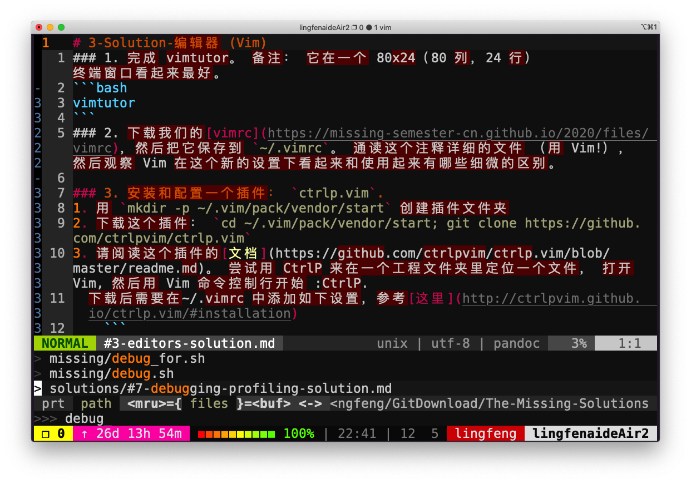
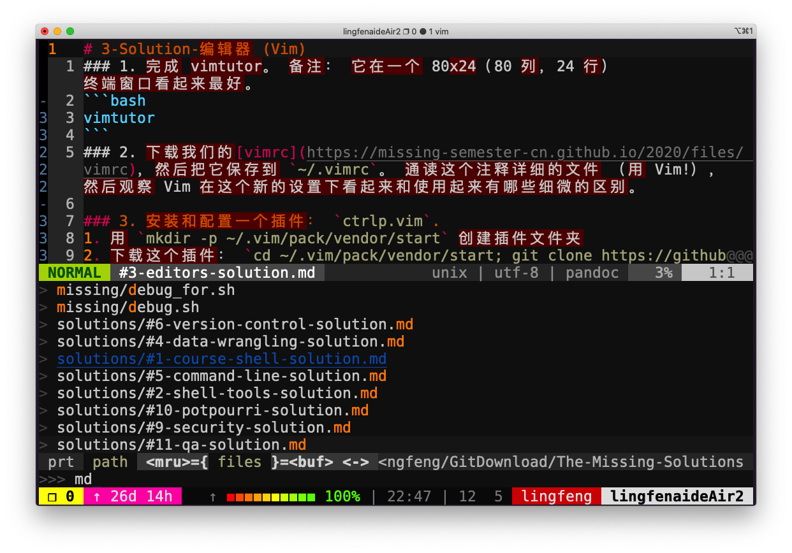
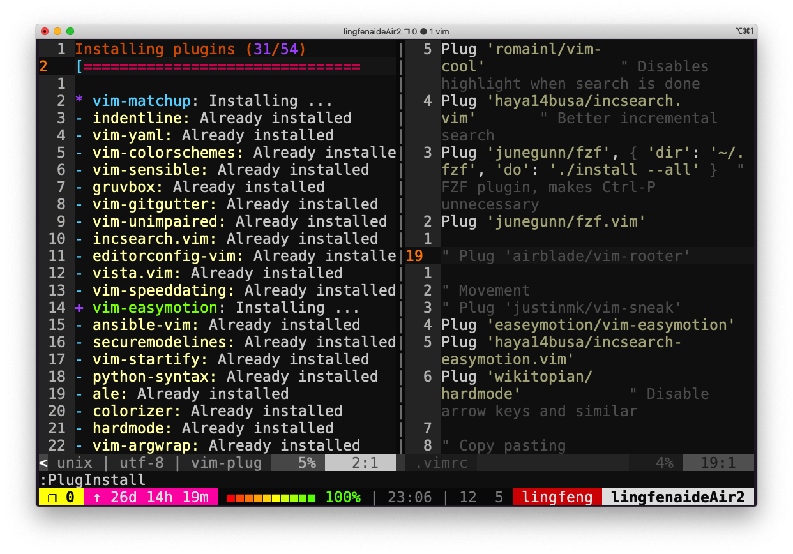

# Lecture03 - 编辑器 (Vim)

写作和写代码是两项非常不同的活动。与编写一大段文字相比，在编程时，我们需要经常在文件间进行切换、阅读、浏览和修改代码。因此代码编辑器和文本编辑器是不同类型的两种工具（例如微软的 Word 与 Visual Studio Code ）。

作为程序员，我们大部分时间都在编辑代码，所以你值得投入时间掌握适合的代码编辑器。通常学习使用一个新的编辑器包含以下步骤：

- 阅读教程（比如这节课以及我们为你提供的资源）
- 坚持使用它来完成你所有的编辑工作（即使一开始这会让你的工作效率降低）
- 随时查阅，如果某个操作看起来像是有更方便的实现方法，一般情况下真的会有

如果你按照上述方法，并且坚持使用新的编辑器完成你所有的文本编辑任务，那么学习一个复杂的代码编辑器的过程是这样的：在开始的两个小时内，你将学会基本的编辑器功能，如打开和编辑文件、保存与退出、浏览缓冲区。一旦你学习时长累计达到 20 个小时之后，你使用新编辑器的效率应该和你以前使用的编辑器一样快。之后，其益处开始显现：有了足够的知识和肌肉记忆，使用新的编辑器可以节省你的时间。现代文本编辑器是复杂而强大的工具，所以学习永远不会停止：随着你学习的深入，你的效率会变得更高。

## 该学习哪种编辑器？

程序员们对他们自己正在使用的文本编辑器通常有着非常强的执念 [https://en.wikipedia.org/wiki/Editor_war](https://en.wikipedia.org/wiki/Editor_war) 。

现在最流行的编辑器是什么？ Stack Overflow 的调查 [https://insights.stackoverflow.com/survey/2019/#development-environments-and-tools](https://insights.stackoverflow.com/survey/2019/#development-environments-and-tools) （这个调查可能并不如我们想象的那样客观，因为 Stack Overflow 的用户并不能代表所有程序员）显示， `Visual Studio Code` [https://code.visualstudio.com/](https://code.visualstudio.com/) 是目前最流行的代码编辑器。而 `Vim` [https://www.vim.org/](https://www.vim.org/) 则是最流行的基于命令行的编辑器。

## Vim

这门课的所有导师都使用 Vim 作为他们的编辑器。 Vim 有着悠久历史；它始于 1976 年的 Vi 编辑器，到现在还在不断开发中。 Vim 有很多非常巧妙的设计思想，所以很多其他工具也支持 Vim 模式（例如，140 万人安装了 `Vim emulation for VS code` [https://github.com/VSCodeVim/Vim](https://github.com/VSCodeVim/Vim) ）。即使你最后使用其他编辑器，Vim 也值得学习。

要在 50 分钟内教完 Vim 的所有功能是不可能的，所以我们会专注于解释  Vim 的设计哲学，教你基础知识，并展示一部分高级功能，然后给你提供掌握这个工具所需要的资源。

## Vim 的哲学

在编程时，你会把大量时间花在阅读与编辑上，而不是在写代码上。由于这个原因， Vim 是一个 **多模态** 编辑器：它对于插入文字和操纵文字有不同的模式。 Vim 是可编程的（可以使用 Vimscript 或者像 Python 一样的其他程序语言）， Vim 的接口本身也是一种程序语言：键入操作（以及其助记名）是命令，这些命令也是可组合的。 Vim 避免了使用鼠标，因为那样太慢了； Vim 甚至避免用上下左右键因为那样需要太多的手指移动。

这样的设计哲学使得 Vim 成为了一个能跟上你思维速度的编辑器。

## 编辑模式

Vim 的设计基于以下的设计理念：程序员大多数时间都在阅读、浏览和进行少量的编辑，因此它具有多种操作模式：

- 正常模式：在文件中四处移动光标并进行编辑
- 插入模式：用于插入文本
- 替换模式：用于替换文本
- 可视化（一般，行，块）模式：用于选择文本块
- 命令模式：用于执行命令

在不同的操作模式下，键盘按键的含义也不同。例如， `x` 在插入模式下只是插入字母 `x` ，但是在正常模式会删除当前光标所在的字母，在可视模式下则会删除选中文块。

在默认配置下， Vim 会在左下角显示当前的模式。 Vim 启动时的默认模式是正常模式。通常你会把大部分时间花在正常模式和插入模式。

你可以按下 `<ESC>` （退出键）从任何其他模式返回正常模式。在正常模式下，按下 `i` 键进入插入模式，按下 `R` 键进入替换模式，按下 `v` 键进入可视化（一般）模式，按下 `V` 键进入可视化（行）模式，按下 `<C-v>` （ `Ctrl-V` 有时也写作 `^V` ）键进入可视化（块）模式，用 `:` 进入命令模式。

因为你会在使用 Vim 时经常使用 `<ESC>` 键，所以可以考虑把大小写锁定键重定义成 `<ESC>` 键（`MacOS 教程` [https://vim.fandom.com/wiki/Map_caps_lock_to_escape_in_macOS](https://vim.fandom.com/wiki/Map_caps_lock_to_escape_in_macOS)）。

## 基本操作

### 插入文本

在正常模式下，按下 `i` 键进入插入模式。现在 Vim 跟很多其他的编辑器一样，直到你键入 `<ESC>` 返回正常模式。你只需要掌握这一点和上面介绍的所有基础知识就可以使用 Vim 来编辑文件了（虽然如果你一直停留在插入模式内不一定高效）。

### 缓存，标签页，窗口

Vim 会维护一系列打开的文件，称为“缓存区”。一个 Vim 会话包含一系列标签页，每个标签页包含一系列窗口（分隔面板）。每个窗口都显示一个缓存区。与网页浏览器等其他你熟悉的程序不同，缓存区和窗口不是一一对应的关系；窗口只是视图。一个缓存区可以在 **多个** 窗口中打开，甚至在同一个标签页内的多个窗口打开。这个功能很好用，例如在同一时间查看一个文件的两个不同部分。

默认情况下，Vim 打开时只有一个标签页，这个标签页也包含一个窗口。

### 命令行

在正常模式下输入 `:` 进入命令行模式。在键入 `:` 后，你的光标会立即跳到屏幕底部的命令行。这个模式有很多功能，包括打开、保存、关闭文件，以及退出 Vim [https://twitter.com/iamdevloper/status/435555976687923200](https://twitter.com/iamdevloper/status/435555976687923200) 。

- `:q` 退出（关闭窗口）
- `:w` 保存（写）
- `:wq` 保存并退出
- `:e {文件名}` 打开要编辑的文件
- `:ls` 显示打开的缓存区
- `:help {标题}` 打开帮助文档
    - `:help :w` 打开 `:w` 命令的帮助文档
    - `:help w` 打开 `w` 移动的帮助文档

## Vim 的接口其实是一种程序语言

Vim 最重要的设计思想是 Vim 的界面本身是一个程序语言。按键操作（以及他们的助记名）本身是命令， 这些命令可以组合使用。这使得移动和编辑更加高效，特别是你形成肌肉记忆以后。

### 移动

你应该花费大部分时间在正常模式下，使用移动命令在缓存中导航。在 Vim 里面移动也被称为“名词”， 因为它们指的是文字块。

- 基本移动: `hjkl` （左， 下， 上， 右）
- 词： `w` （下一个词）， `b` （词初）， `e` （词尾）
- 行： `0` （行初）， `^` （第一个非空格字符）， `$` （行尾）
- 屏幕： `H` （屏幕首行）， `M` （屏幕中间）， `L` （屏幕底部）
- 翻页： `Ctrl-u` （上翻）， `Ctrl-d` （下翻）
- 文件： `gg` （文件头）， `G` （文件尾）
- 行号： `:{行号}<CR>` 或者 `{行号}G` ({行号}为行数)
- 杂项： `%` （找到配对，比如括号或者 /* */ 之类的注释对）
- 查找： `f{字符}` ， `t{字符}` ， `F{字符}` ， `T{字符}`
    - 在当前行向前/向后查找{字符}
    - `,` / `;` 用于导航匹配
- 搜索: `/{正则表达式}` ， `n` / `N` 用于导航匹配

### 选择

可视化模式:

- 可视化：`v`
- 可视化行： `V`
- 可视化块：`Ctrl+v`

可以用移动命令来进行选择。

### 编辑

所有你需要用鼠标做的事，你现在都可以用键盘来做：使用编辑命令和移动命令的组合来完成。在这里 Vim 的界面开始看起来像一种程序语言了。Vim 的编辑命令也被称为“动词”， 因为动词可以作用于名词。

- `i` 进入插入模式
    - 但是对于操作/编辑文本，不单想用退格键完成
- `O` / `o` 在之上/之下插入一行
- `d{motion}` 删除 {motion}
    - 例如， `dw` 删除词， `d$` 删除到行尾， `d0` 删除到行首
- `c{motion}` 改变 {motion}
    - 例如， `cw` 改变单词
    - 比如 `d{motion}` 再 `i`
- `x` 删除字符（等同于 `dl` ）
- `s` 替换字符（等同于 `xi` ）
- 可视化模式 + 操作
    - 选择文字， `d` 删除它或者 `c` 改变它
- `u` 撤销， `<C-r>` 重做
- `y` 复制 / “yank” （其他一些命令比如 `d` 也会复制）
- `p` 粘贴
- 更多值得学习的: 比如 `~` 改变字符的大小写

### 计数

你可以把“名词”和“动词”与计数结合起来，这会执行指定操作若干次。

- `3w` 向前移动三个词
- `5j` 向下移动5行
- `7dw` 删除7个词

### 修饰语

你可以用修饰语改变“名词”的意义。修饰语有 `i` ，表示“内部”或者“在内”，和 `a`，表示“周围”。

- `ci(` 改变当前括号内的内容
- `ci[` 改变当前方括号内的内容
- `da'` 删除一个单引号字符串，包括周围的单引号

## 演示

这里是一个有问题的 `fizz buzz` [https://en.wikipedia.org/wiki/Fizz_buzz](https://en.wikipedia.org/wiki/Fizz_buzz) 实现：

```py
def fizz_buzz(limit):
    for i in range(limit):
        if i % 3 == 0:
            print('fizz')
        if i % 5 == 0:
            print('fizz')
        if i % 3 and i % 5:
            print(i)

def main():
    fizz_buzz(10)
```

我们会改正以下问题：

- 主函数没有被调用
- 从 0 而不是 1 开始
- 对于 15 的整数倍，在不同行打印 “fizz” 和 “buzz”
- 对于 5 的整数倍，打印 “fizz”
- 采用硬编码的参数 10 而不是接收一个命令行参数

详情请看讲座视频中的演示。比较上面用 Vim 的操作和你可能使用其他程序的操作。值得一提的是 Vim 需要很少的键盘操作，允许你编辑的速度跟上你思维的速度。

改正方案如下：

- 主函数没有被调用
    - `G` 文件尾
    - `o` 向下打开一个新行
    - 输入 `“if name...”`
- 从 0 而不是 1 开始
    - 搜索 `/range`
    - `ww` 向前移动两个词
    - `i` 插入文字， `1,`
    - `ea` 在 limit 后插入， `+1`
- 在新的一行 “fizzbuzz”
    - `jj$i` 插入文字到行尾
    - 加入 `, end=''`
    - `jj.` 重复第二个打印
    - `jjo` 在 if 打开一行
    - 加入 `else: print()`
- fizz fizz
    - `ci'` 变到 `fizz`
- 命令控制行参数
    - `ggO` 向上打开
    - “import sys”
    - `/10`
    - `ci(` to “int(sys.argv[1])”

## 自定义 Vim

Vim 有一个位于 `~/.vimrc` 的文本配置文件（包含 Vim 脚本命令）。你可能会使用很多基本设置。

我们提供一个文档详细的基本设置，你可以用它当作你的配置。我们推荐使用这个配置因为它修复了一些 Vim 默认设置的奇怪行为。在 [https://missing.csail.mit.edu/2020/files/vimrc](https://missing.csail.mit.edu/2020/files/vimrc) 下载我们的配置，然后将它保存到 `~/.vimrc` 。

Vim 能够被自定义，值得你花时间探索自定义选项。你可以参考其他人的在 GitHub 上共享的配置文件，比如，你的导师的 Vim 配置 ( Anish 的在 [https://github.com/anishathalye/dotfiles/blob/master/vimrc](https://github.com/anishathalye/dotfiles/blob/master/vimrc) ， Jon 的在 [https://github.com/jonhoo/configs/blob/master/editor/.config/nvim/init.vim](https://github.com/jonhoo/configs/blob/master/editor/.config/nvim/init.vim) (uses `neovim` [https://neovim.io/](https://neovim.io/) )， Jose 的在 [https://github.com/JJGO/dotfiles/blob/master/vim/.vimrc](https://github.com/JJGO/dotfiles/blob/master/vim/.vimrc))。有很多好的博客文章也聊到了这个话题。尽量不要复制粘贴别人的整个配置文件，而是阅读和理解它，然后采用对你有用的部分。

## 扩展 Vim

Vim 有很多扩展插件。与很多互联网上已经过时的建议相反，你不需要在 Vim 使用一个插件管理器（从 Vim 8.0 开始）。相反，你可以使用内置的插件管理系统。只需要创建一个 `~/.vim/pack/vendor/start/` 目录，然后把插件放到那里（比如通过 `git clone` ）。

以下是一些我们最爱的插件：

- `ctrlp.vim` [https://github.com/ctrlpvim/ctrlp.vim](https://github.com/ctrlpvim/ctrlp.vim)：模糊文件查找
- `ack.vim` [https://github.com/mileszs/ack.vim](https://github.com/mileszs/ack.vim)：代码搜索
- `nerdtree` [https://github.com/preservim/nerdtree](https://github.com/preservim/nerdtree)：文件浏览器
- `vim-easymotion` [https://github.com/easymotion/vim-easymotion](https://github.com/easymotion/vim-easymotion)：魔术操作

我们尽量避免在这里提供一份冗长的插件列表。你可以查看讲师们的开源配置文件 (Anish 的 [https://github.com/anishathalye/dotfiles](https://github.com/anishathalye/dotfiles)， Jon 的 [https://github.com/jonhoo/configs](https://github.com/jonhoo/configs)，Jose 的 [https://github.com/JJGO/dotfiles](https://github.com/JJGO/dotfiles)) 来看看我们使用的其他插件。 浏览 Vim Awesome [https://vimawesome.com/](https://vimawesome.com/) 来了解一些很棒的插件。这个话题也有很多博客文章：搜索 “best Vim plugins”。

## 其他程序的 Vim 模式

很多工具提供了 Vim 模式。这些 Vim 模式的质量参差不齐；根据不同的工具，有的提供了很多酷炫的 Vim 功能，但是大多数对基本功能支持的很好。

### Shell

如果你是一个 Bash 用户，使用 `set -o vi` 。如果你用 Zsh：使用 `bindkey -v` 。Fish 使用 `fish_vi_key_bindings` 。另外，不管利用什么 shell，你可以 `export EDITOR=vim` 。这是一个用来决定当一个程序需要启动编辑时启动哪个的环境变量。例如， `git` 会使用这个编辑器来编辑 commit 信息。

### Readline

很多程序使用 `GNU Readline` [https://tiswww.case.edu/php/chet/readline/rltop.html](https://tiswww.case.edu/php/chet/readline/rltop.html) 库来作为它们的命令控制行界面。Readline 也支持基本的 Vim 模式，可以通过在 `~/.inputrc` 添加如下行开启：

```sh
set editing-mode vi
```

比如，在这个设置下，Python REPL 会支持 Vim 快捷键。

### 其他

甚至有 Vim 的网页浏览快捷键 `browsers` [http://vim.wikia.com/wiki/Vim_key_bindings_for_web_browsers](http://vim.wikia.com/wiki/Vim_key_bindings_for_web_browsers) ，受欢迎的有用于 Google Chrome 的 `Vimium` [https://chrome.google.com/webstore/detail/vimium/dbepggeogbaibhgnhhndojpepiihcmeb?hl=en](https://chrome.google.com/webstore/detail/vimium/dbepggeogbaibhgnhhndojpepiihcmeb?hl=en) 和用于 Firefox 的 `Tridactyl` [https://github.com/tridactyl/tridactyl](https://github.com/tridactyl/tridactyl) 。你甚至可以在 `Jupyter notebooks` [https://github.com/lambdalisue/jupyter-vim-binding](https://github.com/lambdalisue/jupyter-vim-binding) 中用 Vim 快捷键。这个列表 [https://reversed.top/2016-08-13/big-list-of-vim-like-software](https://reversed.top/2016-08-13/big-list-of-vim-like-software) 中列举了支持类 vim 键位绑定的软件。

## Vim 进阶

这里我们提供了一些展示这个编辑器能力的例子。我们无法把这类东西的所有讲授给你，但是你可以在使用中学习。一个好的方法是：当你在使用你的编辑器的时候感觉“一定有更好的方法来做这个”，那么很可能真的有：上网查找一下。

### 搜索和替换

`:s` （替换）命令（文档）。

- `%s/foo/bar/g`
    - 在整个文件中将 `foo` 全局替换成 `bar`
- `%s/\[.*\](\(.*\))/\1/g`
    - 将有命名的 Markdown 链接替换成简单 URLs

### 多窗口

- 用 `:sp` / `:vsp` 来分割窗口
- 同一个缓存可以在多个窗口中显示。

### 宏

- `q{字符}` 来开始在寄存器 `{字符}` 中录制宏
- `q` 停止录制
- `@{字符}` 重放宏
- 宏的执行遇错误会停止
- `{计数}@{字符}` 执行一个宏{计数}次
- 宏可以递归
    - 首先用 `q{字符}q` 清除宏
    - 录制该宏，用 `@{字符}` 来递归调用该宏 （在录制完成之前不会有任何操作）
- 例子：将 xml 转成 json (file [https://missing-semester-cn.github.io/2020/files/example-data.xml](https://missing-semester-cn.github.io/2020/files/example-data.xml))
    - 一个有 “name” / “email” 键对象的数组
    - 用一个 Python 程序？
    - 用 sed / 正则表达式
        - `g/people/d`
        - `%s/<person>/{/g`
        - `%s/<name>\(.*\)<\/name>/"name": "\1",/g`
        - ...
    - Vim 命令 / 宏
        - `Gdd` , `ggdd` 删除第一行和最后一行
        - 格式化最后一个元素的宏 （寄存器 `e` ）
            - 跳转到有 `<name>` 的行
            - `qe^r"f>s": "<ESC>f<C"<ESC>q`
        - 格式化一个的宏
            - 跳转到有 `<person>` 的行
            - `qpS{<ESC>j@eA,<ESC>j@ejS},<ESC>q`
        - 格式化一个标签然后转到另外一个的宏
            - 跳转到有 `<person>` 的行
            - `qq@pjq`
        - 执行宏到文件尾
            - `999@q`
        - 手动移除最后的 `,` 然后加上 `[` 和 `]` 分隔符

## 扩展资料

- `vimtutor` 是一个 Vim 安装时自带的教程
- `Vim Adventures` [https://vim-adventures.com/](https://vim-adventures.com/) 是一个学习使用 Vim 的游戏
- `Vim Tips Wiki` [https://vim.fandom.com/wiki/Vim_Tips_Wiki](https://vim.fandom.com/wiki/Vim_Tips_Wiki)
- `Vim Advent Calendar` [https://vimways.org/2019/](https://vimways.org/2019/) 有很多 Vim 小技巧
- `Vim Golf` [http://www.vimgolf.com/](http://www.vimgolf.com/) 是用 Vim 的用户界面作为程序语言的 `code golf` [https://en.wikipedia.org/wiki/Code_golf](https://en.wikipedia.org/wiki/Code_golf)
- `Vi/Vim Stack Exchange` [https://vi.stackexchange.com/](https://vi.stackexchange.com/)
- `Vim Screencasts` [http://vimcasts.org/](http://vimcasts.org/)
- `Practical Vim` [https://pragprog.com/titles/dnvim2/practical-vim-second-edition/](https://pragprog.com/titles/dnvim2/practical-vim-second-edition/) （书籍）

## 课后练习

1. 完成 `vimtutor` 。备注：它在一个 80x24 [https://en.wikipedia.org/wiki/VT100](https://en.wikipedia.org/wiki/VT100) （80 列，24 行） 终端窗口看起来效果最好。
2. 下载我们提供的 `vimrc` [https://missing.csail.mit.edu/2020/files/vimrc](https://missing.csail.mit.edu/2020/files/vimrc) ，然后把它保存到 `~/.vimrc` 。通读这个注释详细的文件（用 Vim!）， 然后观察 Vim 在这个新的设置下看起来和使用起来有哪些细微的区别。
3. 安装和配置一个插件：`ctrlp.vim` [https://github.com/ctrlpvim/ctrlp.vim](https://github.com/ctrlpvim/ctrlp.vim)
    1. 用 `mkdir -p ~/.vim/pack/vendor/start` 创建插件文件夹
    2. 下载这个插件： `cd ~/.vim/pack/vendor/start; git clone https://github.com/ctrlpvim/ctrlp.vim`
    3. 阅读这个插件的文档 [https://github.com/ctrlpvim/ctrlp.vim/blob/master/readme.md](https://github.com/ctrlpvim/ctrlp.vim/blob/master/readme.md) 。 尝试用 CtrlP 来在一个工程文件夹里定位一个文件，打开 Vim , 然后用 Vim 命令控制行开始 `:CtrlP`
    4. 自定义 CtrlP：添加 `configuration` [https://github.com/ctrlpvim/ctrlp.vim/blob/master/readme.md#basic-options](https://github.com/ctrlpvim/ctrlp.vim/blob/master/readme.md#basic-options) 到你的 `~/.vimrc` 来用按 Ctrl-P 打开 CtrlP
4. 练习使用 Vim, 在你自己的机器上重做演示。
5. 下个月用 Vim 完成 **所有的** 文件编辑。每当不够高效的时候，或者你感觉 “一定有一个更好的方式”时， 尝试求助搜索引擎，很有可能有一个更好的方式。如果你遇到难题，可以来我们的答疑时间或者给我们发邮件。
6. 在其他工具中设置 Vim 快捷键 （见上面的操作指南）。
7. 进一步自定义你的 `~/.vimrc` 和安装更多插件。
8. （高阶）用 Vim 宏将 XML 转换到 JSON (例子文件 [https://missing-semester-cn.github.io/2020/files/example-data.xml](https://missing-semester-cn.github.io/2020/files/example-data.xml) )。 尝试着先完全自己做，但是在你卡住的时候可以查看上面宏章节。

## 课后练习解答

1. 完成 `vimtutor` 。备注：它在一个 80x24 [https://en.wikipedia.org/wiki/VT100](https://en.wikipedia.org/wiki/VT100) （80 列，24 行） 终端窗口看起来效果最好。

    **参考解答：**

    运行如下命令：

    ```sh
    $ vimtutor
    ```

    显示结果如下：

    ```
    ===============================================================================
    =    W e l c o m e   t o   t h e   V I M   T u t o r    -    Version 1.7      =
    ===============================================================================

        Vim is a very powerful editor that has many commands, too many to
        explain in a tutor such as this.  This tutor is designed to describe
        enough of the commands that you will be able to easily use Vim as
        an all-purpose editor.

        The approximate time required to complete the tutor is 25-30 minutes,
        depending upon how much time is spent with experimentation.
    ```

2. 下载我们提供的 `vimrc` [https://missing.csail.mit.edu/2020/files/vimrc](https://missing.csail.mit.edu/2020/files/vimrc) ，然后把它保存到 `~/.vimrc` 。通读这个注释详细的文件（用 Vim!）， 然后观察 Vim 在这个新的设置下看起来和使用起来有哪些细微的区别。

    **参考解答：**

    略。

3. 安装和配置一个插件：`ctrlp.vim` [https://github.com/ctrlpvim/ctrlp.vim](https://github.com/ctrlpvim/ctrlp.vim)

    1. 用 `mkdir -p ~/.vim/pack/vendor/start` 创建插件文件夹

        **参考解答：**

        运行命令：

        ```sh
        $ mkdir -p ~/.vim/pack/vendor/start
        ```

    2. 下载这个插件： `cd ~/.vim/pack/vendor/start; git clone https://github.com/ctrlpvim/ctrlp.vim`

        **参考解答：**

        下载后需要在` ~/.vimrc` 中添加如下设置，参考 [这里](http://ctrlpvim.github.io/ctrlp.vim/#installation)

        ```sh
        set runtimepath^=~/.vim/pack/vendor/start/ctrlp.vim 
        ```

    3. 阅读这个插件的文档 [https://github.com/ctrlpvim/ctrlp.vim/blob/master/readme.md](https://github.com/ctrlpvim/ctrlp.vim/blob/master/readme.md) 。 尝试用 CtrlP 来在一个工程文件夹里定位一个文件，打开 Vim , 然后用 Vim 命令控制行开始 `:CtrlP`

        **参考解答：**

        

    4. 自定义 CtrlP：添加 `configuration` [https://github.com/ctrlpvim/ctrlp.vim/blob/master/readme.md#basic-options](https://github.com/ctrlpvim/ctrlp.vim/blob/master/readme.md#basic-options) 到你的 `~/.vimrc` 来用按 Ctrl-P 打开 CtrlP

        **参考解答：**

        ```sh
        let g:ctrlp_map ='<c-p>' 
        let g:ctrlp_cmd = 'CtrlP'
        let g:ctrlp_working_path_mode = 'ra' #设置默认路径为当前路径
        ```

        

4. 练习使用 Vim, 在你自己的机器上重做演示。

    **参考解答：**

    略。

5. 下个月用 Vim 完成 **所有的** 文件编辑。每当不够高效的时候，或者你感觉 “一定有一个更好的方式”时， 尝试求助搜索引擎，很有可能有一个更好的方式。如果你遇到难题，可以来我们的答疑时间或者给我们发邮件。

    **参考解答：**

    略。

6. 在其他工具中设置 Vim 快捷键 （见上面的操作指南）。

    **参考解答：**

    略。

7. 进一步自定义你的 `~/.vimrc` 和安装更多插件。

    **参考解答：**

    安装 vim-plug

    ```sh
    $ curl -fLo ~/.vim/autoload/plug.vim --create-dirs \
    https://raw.githubusercontent.com/junegunn/vim-plug/master/plug.vim
    ```

    修改 ~/.vimrc

    ```sh
    call plug#begin()
    Plug 'preservim/NERDTree' #需要安装的插件 NERDTree
    Plug 'wikitopian/hardmode'  #安装 hardmode
    ..... # 更多插件
    call plug#end()
    ```

    在 vim 命令行中执行 `:PlugInstall`

    

8. （高阶）用 Vim 宏将 XML 转换到 JSON (例子文件 [https://missing-semester-cn.github.io/2020/files/example-data.xml](https://missing-semester-cn.github.io/2020/files/example-data.xml) )。 尝试着先完全自己做，但是在你卡住的时候可以查看上面宏章节。

    **参考解答：**

    1. Gdd, ggdd 删除第一行和最后一行
    2. 格式化最后一个元素的宏 （寄存器 e）
    跳转到有 `<name>` 的行 `qe^r"f>s": "<ESC>f<C"<ESC>q`
    3. 格式化一个人的宏
    跳转到有 `<person>` 的行 `qpS{<ESC>j@eA,<ESC>j@ejS},<ESC>q`
    4. 格式化一个人然后转到另外一个人的宏
    跳转到有 `<person>` 的行 `qq@pjq`
    5. 执行宏到文件尾 `999@q`
    6. 手动移除最后的 , 然后加上 [ 和 ] 分隔符